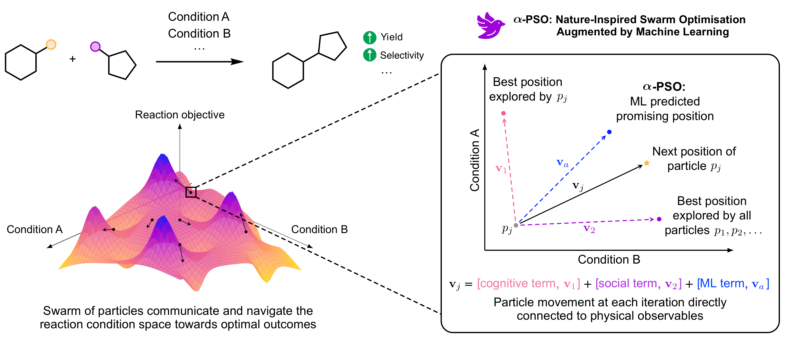

<div align="center">
  
</div>


# AlphaSwarm: ML-guided Particle Swarm Optimisation for Chemical Reaction Optimisation

[](https://www.python.org/downloads/release/python-3123/)
[](https://opensource.org/licenses/MIT)
[](https://mypy-lang.org/)
[](https://arxiv.org/abs/2509.11798)
[](https://github.com/astral-sh/ruff)
[](https://github.com/astral-sh/uv)


<div align="center">
  
</div>


## 🚀 Installation

> Install [uv](https://github.com/astral-sh/uv) with the command
>```bash
>pipx install uv
>```

Create the environment with the following command
```bash
uv venv alphaswarm --python=3.12
```
and activate the environment
```
source .venv/bin/activate
# source alphaswarm/bin/activate # on MacOS
```
Alternatively, you can use [conda](https://docs.conda.io/projects/conda/en/latest/index.html) / [mamba](https://mamba.readthedocs.io/en/latest/index.html) to create the environment and install all required packages (installation used for all benchmarks and experiments):

```bash
git clone https://github.com/schwallergroup/alphaswarm.git
cd alphaswarm
conda env create -f environment.yml
# mamba env create -f environment.yml
python -m pip install -e .
```

## 📖 Usage

### 🖥️ Benchmark

To run a benchmark, define a configuration file, e.g. `benchmark.toml`:

```toml
file_path = "data/benchmark/virtual_experiment.csv"  # Path to the dataset with features and target
y_columns = ["AP yield", "AP selectivity"]  # Columns containing the objectives values
exclude_columns = ["catalyst", "base"]  # (Optional) Columns to exclude from the feature set used for modelling, usually contains text data

seed = 42  # Seed for reproducibility
n_iter = 3  # Number of iterations
n_particles = 24  # Number of particles (batch size)
init_method = "sobol"  # Initialisation method (random, sobol, LHS, halton)
algo = "alpha-pso"  # Algorithm to use (canonical-pso, alpha-pso, qnehvi, sobol)

[pso_params]  # only for (canonical-pso, alpha-pso)
c_1 = 1.0  # Cognitive parameter
c_2 = 1.0  # Social parameter
c_a = 1.0  # ML parameter
w = 1.0  # Inertia parameter
n_particles_to_move = [0, 0]  # Number of particles to move directly to ML predictions at each iteration after initialisation (list size = iteration_number - 1)

objective_function = "weighted_sum"  # Objective function to use (weighted_sum, weighted_power, ...)

[obj_func_params]
weights = [1.0, 1.0]  # Weights for the weighted sum objective function
noise = 0.0  # Noise to add to the objectives

[model_config]
kernel = "MaternKernel"  # Kernel to use (MaternKernel, KMaternKernel)
kernel_params = "default"  # Kernel parameters
training_iter = 1000  # Number of iterations for training
```

Then, run the benchmark with the following command:

```bash
alphaswarm benchmark benchmark.toml
```


### 🧪 Experimental campaign

To run an experimental campaign, you need a chemical space file (`.csv`) that contains your reaction features. This file must also include a column named `rxn_id` for the reaction identifiers.

If your file includes non-feature columns describing reaction conditions (e.g., catalyst, base, solvent), you must list them in the configuration file under the `exclude_columns` parameter. This ensures they are excluded from the model's feature set. The config files used in the manuscript accompanying this repository can be found in the [/configs](data/experimental_campaigns/pso_suzuki/configs) directory.

An example of a configuration file is shown below:

> [!WARNING]
> The chemical space features for the experimental campaign must be **normalised** between 0 and 1.
> Normalisation can be done with the [`normalise_features(...)`](src/alphaswarm/utils/utils.py) function.

```toml
chemical_space_file = "data/experimental_campaigns/example/chemical_space.csv"  # Path to the chemical space
exclude_columns = ["ligand", "solvent", "precursor", "base"]  # (Optional) Columns to exclude from the input features, usually columns containing text data (rxn_id is automatically excluded)

iteration_number = 1  # Number of iterations (1 for the initialisation)

seed = 42  # Random seed for reproducibility
n_particles = 96  # Number of particles (batch size)
init_method = "sobol"  # Initialisation method (random, sobol, LHS, halton)
algo = "alpha-pso"  # Algorithm to use (canonical-pso, alpha-pso, qnehvi, sobol)

[pso_params]  # only for (canonical-pso, alpha-pso)
c_1 = 1.0  # Cognitive parameter
c_2 = 1.0  # Social parameter
c_a = 1.0  # ML parameter
w = 1.0  # Inertia parameter
n_particles_to_move = [0]  # Number of particles to move directly to ML predictions at each iteration after initialisation (list size = iteration_number - 1)

objective_columns = ["AP yield", "AP selectivity"]  # Columns specifying the objectives

# Suggestions path/file format
pso_suggestions_path = "data/experimental_campaigns/example/pso_plate_suggestions"  # output path for the PSO suggestions
pso_suggestions_format = "PSO_plate_{}_suggestions.csv"  # file format of the PSO suggestions
# Experimental/Training data path/file format
experimental_data_path = "data/experimental_campaigns/example/pso_training_data"  # path to the experimental data
experimental_data_format = "PSO_plate_{}_train.csv"  # file format of the training data

[model_config]
kernel = "MaternKernel"  # Kernel to use (MaternKernel, KMaternKernel)
kernel_params = "default"  # Kernel parameters
training_iter = 1000  # Number of iterations for training
```

Then, run the experimental campaign with the following command:

```bash
alphaswarm experimental experimental.toml
```

### Package structure
The package is structured as follows:

<details>
    <summary>📁<b>alphaswarm/</b></summary>
    <pre>
    ├── LICENSE  # MIT License file
    ├── README.md  # Installation and usage instructions
    |── tox.ini  # Configuration file for tox (testing)
    ├── pyproject.toml  # Project configuration file
    ├── environment.yml # Configuration file for conda environment
    ├── <b>data/</b>
    │   ├── <b>benchmark/</b>  # Contains the virtual experiments for benchmarking
    │   │   ├── buchwald_virtual_benchmark.csv
    │   │   ├── ni_suzuki_virtual_benchmark.csv
    │   │   ├── sulfonamide_virtual_benchmark.csv
    │   │   └── <b>experimental_data/</b>  # Contains the experimental data for training emulators
    │   │       ├── buchwald_train_data.csv
    │   │       ├── ni_suzuki_train_data.csv
    │   │       └── sulfonamide_train_data.csv
    │   ├── <b>experimental_campaigns/</b>
    │   │   └── pso_suzuki/  # Example of an experimental campaign
    │   │       ├── <b>chemical_spaces/</b>  # Contains the chemical spaces
    │   │       │   └── pso_suzuki_chemical_space.csv
    │   │       ├── <b>configs/</b>  # Contains the config .toml files use to obtain experimental suggestions
    │   │       │   ├── pso_suzuki_iter_1.toml
    │   │       │   ...
    │   │       ├── <b>pso_plate_suggestions/</b>  # Contains the experimental suggestions
    │   │       |   ├── PSO_suzuki_plate_1_suggestions.csv
    │   │       |   ...
    │   │       └── <b>pso_training_data/</b>  # Contains the training data (experimental results)
    │   │           ├── PSO_suzuki_plate_1_train.csv
    │   │           ...
    │   │── <b>HTE_datasets/</b> # Contains the experimental HTE datasets in SURF format
    │   │   ├── pd_sulfonamide_SURF.csv
    │   │   └── pd_suzuki_SURF.csv
    ├── <b>src/</b>
    │   └── <b>alphaswarm/</b>
    │       ├── __about__.py
    │       ├── __init__.py
    │       ├── cli.py  # Command line interface tools
    │       ├── configs.py  # Configurations for benchmark and experimental campaigns
    │       ├── metrics.py  # Metrics for the benchmark
    │       ├── objective_functions.py  # Objective functions for the benchmark
    │       ├── pso.py  # Main PSO algorithm
    │       ├── swarms.py  # Particle and Swarm classes
    │       ├── <b>acqf/</b>  # Acquisition functions
    │       │   ├── acqf.py
    │       │   └── acqfunc.py
    │       ├── <b>models/</b>  # Surrogate models
    │       │   └── gp.py  # Gaussian Process models
    │       └── <b>utils/</b>
    │           ├── logger.py  # Logger for the package
    │           ├── moo_utils.py  # Utilities for multi-objective optimisation
    │           ├── tensor_types.py  # Type definitions for tensors
    │           └── utils.py  # General utilities
    └── <b>tests/</b>  # Contains all the unit tests
    </pre>
</details>

All data is stored in the [data/](data/) directory. The [benchmark/](data/benchmark/) directory contains the virtual experiments used for benchmarking. The [experimental_campaigns/](data/experimental_campaigns/) directory contains the chemical spaces and the experimental data for the experimental campaigns.


## 🛠️ Development details

<details>
  <summary>See developer instructions</summary>


To install, run

```bash
pip install -e ".[test]"
```

To run style checks:

```bash
uv pip install pre-commit
pre-commit run -a
```

### Run style checks, coverage, and tests

[Ruff](https://github.com/astral-sh/ruff) is used for linting and type checking. To run the tests, use the following command:

```bash
ruff check src/ --fix
```

To test:

```bash
uv pip install tox
python -m tox r -e py312
```

Tensor shapes can be checked using [jaxtyping](https://github.com/patrick-kidger/jaxtyping). To check the shapes, set the `TYPECHECK` environment variable to `1` and run code normally:

```bash
export TYPECHECK=1
```


### Generate coverage badge

Works after running `tox`

```bash
uv pip install "genbadge[coverage]"
genbadge coverage -i coverage.xml
```

</details>
